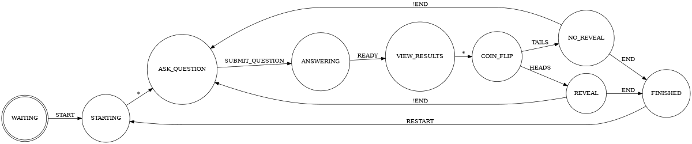

# Technical Details

## Users
All users are firebase anon users

## Game data
All game data is synced through firebase realtime database. Each game gets a Game object, as described in `game.ts`. This contains everything, from the players, the current round, the score, etc.

## Game Loop
The game can be modeled as a finite state machine. See the below DOT code and the image `GAME_FSM.png`

